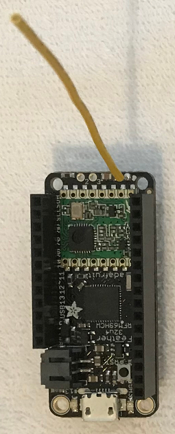
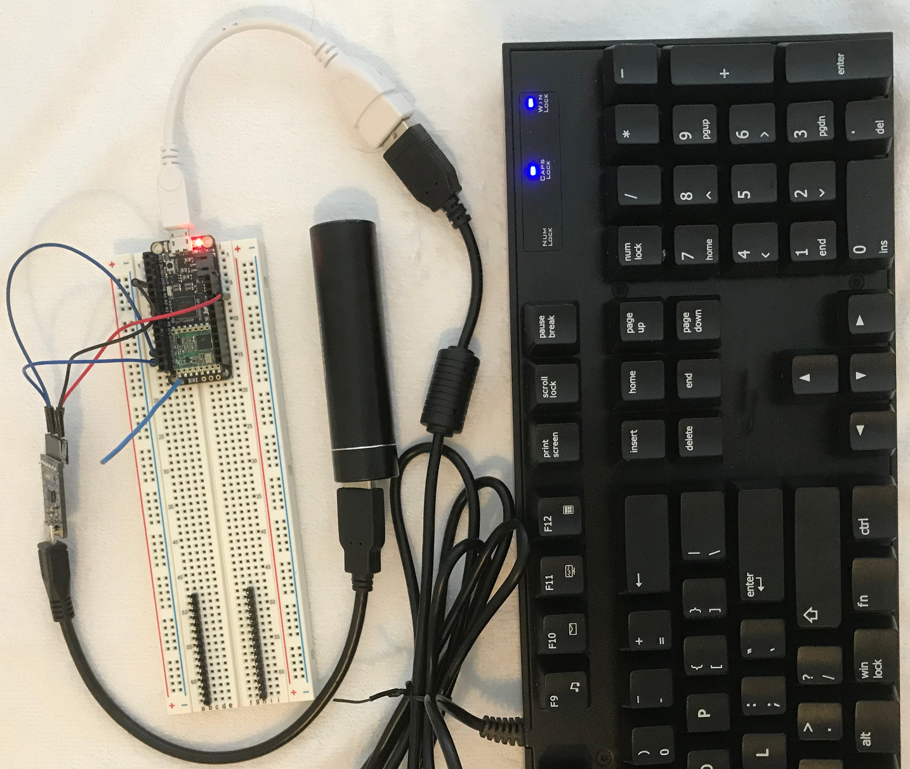

# Wireless USB Keyboard Extender Using RFM69
A long range wireless USB keyboard in two parts.

The USB keyboard plugs into the sender. The sender must have USB host
capabiiity to communicate with the keyboard. The SAMD21 M0 is used for this
project. Every key press and release generates a USB HID (Human Interface
Descriptor) report. The report is a 8 byte data struture which is sent using
the RFM69 radio to the receiver.

The receiver plugs into the computer via a USB port. No other components are
required because the RFM69HCW radio is integrated with the Feather board. The
receiver takes USB HID reports from the RFM69 radio then sends to the computer
over USB.

Be sure to follow Adafruit's tutorials for both boards to make sure the boards
work and the libraries are installed.

## USB keyboard receiver



```
915 MHz -> Feather 32u4 RFM69HCW -> USB cable -> Computer
```
The receiver may use the M0 or 32u4 Feather version. The 32u4 was used here for
no other reason than it was available.

* Adafruit Feather 32u4 RFM69HCW Packet Radio

Headers do not need to be installed on the board. An  antenna is required.

Upload the RFM69KbdRFM69Rx.ino sketch. This program reads USB HID reports from
the RFM69 radio then sends them out the USB keyboard device interface to the
computer. The Feather is powered from the computer.

## USB keyboard sender



The components from left to right are:

* CP2104 USB serial adapter
* Feather M0 with RFM69HCW
* USB phone/tablet charger, 5V 1A
* USB keyboard

```
USB         USB OTG Host
Keyboard -> cable/adapter -> Feather M0 RFM69HCW -> 915 MHz
                             GND  USB  Tx  Rx
                              |    ^   |   ^
                              |    |   |   |
                              |    |   v   |
                             GND  5V   RxD TxD
                             CP2104 USB to serial -> Computer or 5V
```

WARNING: The sender must use the M0 version because it has USB host capability.
The 32u4 does not.

Headers and breadboard are used to connect to power to the Feather board. An
antenna is required.

Upload the RFM69KbdRFM69Tx.ino sketch. This program reads USB HID reports from
the USB keyboard then sends the USB HID reports to the RFM69 radio.

### Upload mode

Powering the Feather is trickier compared to the receiver. When uploading, the
Feather is powered from the computer. The other 5V power source (see below)
MUST be disconnected.

WARNING: Do not connect more than one power source to the Feather at the same
time.

WARNING: When using USB host mode, the Feather RESET button must be pressed
twice to put the board in upload mode. Automatic upload does not work.

```
Feather M0 RFM69HCW -> USB cable -> Computer
```

Another option to avoid switching cables, is upload through the CP2104 board
and the Serial1 port. The RESET button must still be double clicked to start
the upload.

### Sender mode

When using the Feather in keyboard sender mode, the Feather must be powered by
a 5V power source connected to its USB pin.  In this case, a CP2104 USB serial
board provides the 5V power as well as USB serial for debug output via the
Serial1 UART Tx pin.

When debugging is completed, the CP2104 board is not needed but a 5V power
supply is still required.

The Feather battery power option is not useful here because Lithium batteries
do not provide 5V.

## How does the software work?

The pair of boards act as a keyboard pass through. When a key is pressed on the
keyboard, a USB Human Interface Device (HID) report is sent to the sender.
The report is an 8 byte data structure which is explained
[here](https://docs.mbed.com/docs/ble-hid/en/latest/api/md_doc_HID.html#keyboard)
The official USB specifications are available from the [USB Implementors
Forum](https://www.usb.org/documents) but they can be difficult to understand.

The sender sends the HID report out its RFM69 radio. When the receiver receives
the HID report from its RFM69 radio, it sends the HID report out its native USB
port.

### Receiver Code

Most of the code in USBKbdRFM69Rx.ino is from an example from the RadioHead
library. The [Arduino USB Keyboard
library](https://www.arduino.cc/reference/en/language/functions/usb/keyboard/)
provides the USB keyboard emulation over the native USB port. In the code below,
when a USB HID report is received from the RFM69 radio, it is sent out the USB
port.

The statement `rf69_manager.recvfromAck(buf, &len, &from)` receives a block of
bytes from the radio. The block of bytes is a USB HID report from the sender.

The statement `HID().SendReport(2, buf, len)` sends the block of bytes out the USB
port. This function is not documented but is very useful for pass throughs.

The conditional debug dumps out the HID report and the RSSI.

```c
    if (rf69_manager.recvfromAck(buf, &len, &from)) {
      if (!len) return;
      HID().SendReport(2, buf, len);
#ifdef DEBUG_KEYBOARD_RAW
      SERIAL_PORT_MONITOR.print("Received [");
      SERIAL_PORT_MONITOR.print(len);
      SERIAL_PORT_MONITOR.print("]: ");
      for (uint8_t i = 0; i < len ; i++) {
        SERIAL_PORT_MONITOR.print(' '); SERIAL_PORT_MONITOR.print(buf[i], HEX);
      }
      SERIAL_PORT_MONITOR.println();
      SERIAL_PORT_MONITOR.print("RSSI: ");
      SERIAL_PORT_MONITOR.println(rf69.lastRssi(), DEC);
#endif
    } else {
      SERIAL_PORT_MONITOR.println("Receive failed");
    }
```

### Sender Code

Most of the code in USBKbdRFM69Tx.ino is from an example from the RadioHead
library. The [Arduino USBHost
library](https://www.arduino.cc/en/Reference/USBHost) provides the USB host
keyboard feature over the native USB port. In the code below, when a USB HID
report is received from the USB keyboard, it is sent out the RFM69 radio.

NOTE: The Arduino USBHost documention refers only to Due but USBHost works for
Zero, M0, and MKR boards (at least the ones I have tested). The Adafruit
Arduino-compatible boards with SAMD21 and SAMD51 processors also work but I can
only vouch for the boards I have personally tested.

The statement `KeyboardRaw::Parse` function is called by the USBHost::Task
function when a HID report is received from the USB keyboard.

The statement `rf69_manager.sendtoWait(buf, len, DEST_ADDRESS)` sends the HID
report over the RFM69 radio to the receiver.

The KeyboardRaw class is created to intercept the USB HID report from the
USBHost keyboard library. The statement `hostKeyboard.SetReportParser(0, this)`
is how the class redirects the HID reports to itself.

```c
#include <hidboot.h>

class KeyboardRaw : public KeyboardReportParser {
public:
  KeyboardRaw(USBHost &usb) : hostKeyboard(&usb) {
    hostKeyboard.SetReportParser(0, this);
  };

  void Parse(HID *hid, uint32_t is_rpt_id, uint32_t len, uint8_t *buf);

private:
  HIDBoot<HID_PROTOCOL_KEYBOARD> hostKeyboard;
};

void KeyboardRaw::Parse(HID *hid, uint32_t is_rpt_id, uint32_t len, uint8_t *buf)
{
#ifdef DEBUG_KEYBOARD_RAW
  SERIAL_PORT_MONITOR.print("KeyboardRaw::Parse");
  // Show USB HID keyboard report
  for (uint8_t i = 0; i < len ; i++) {
    SERIAL_PORT_MONITOR.print(' '); SERIAL_PORT_MONITOR.print(buf[i], HEX);
  }
  SERIAL_PORT_MONITOR.println();
#endif

  // Call parent/super method
  KeyboardReportParser::Parse(hid, is_rpt_id, len, buf);

  // On error - return
  if (buf[2] == 1)
    return;

  if (len == 8) {
    rf69_manager.sendtoWait(buf, len, DEST_ADDRESS);
  }
}

// Initialize USB Controller
USBHost usb;

// Attach keyboard controller to USB
KeyboardRaw keyboard(usb);
```
